# 商品秒杀系统项目文档

## 1 功能介绍

### 1.1 后台管理端

#### 1.1.1 首页模块

- 登录、退出

密码使用强口令，8-16字符且必须同时包含大小写字母和数字，且加密后保存在数据库中

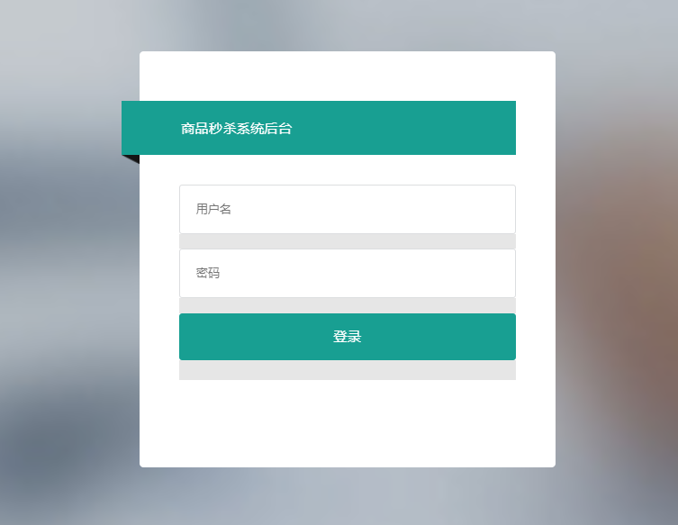

- 欢迎页统计信息

包含系统信息和日志统计信息

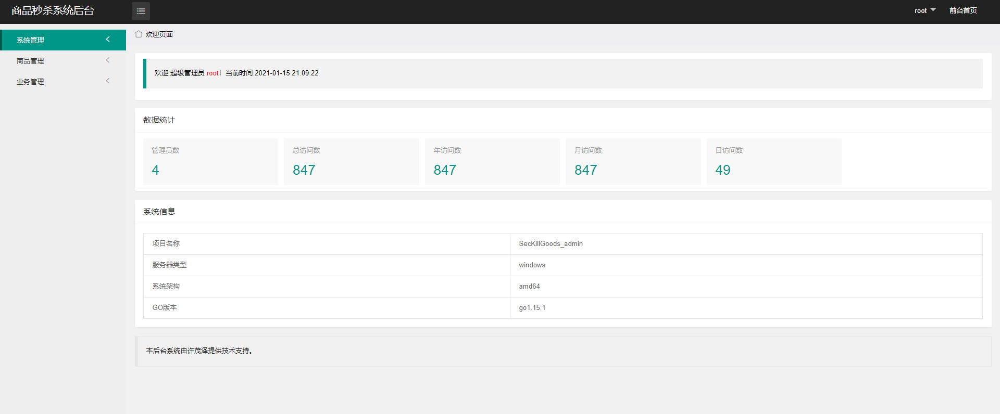

- 个人中心页

管理员可以在此修改本人信息

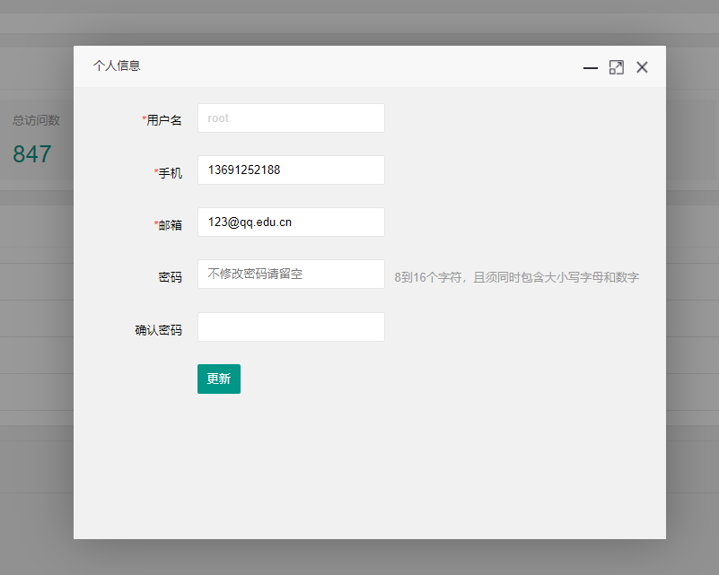

#### 1.1.2 管理员模块

只有超级管理员和高级管理员可以访问管理员模块

- 管理员列表、按用户名搜索

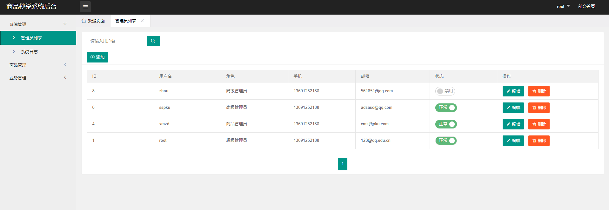

- 更改管理员状态、删除管理员

限定超级管理员只能有一个切不能编辑和删除

- 增加管理员、编辑管理员

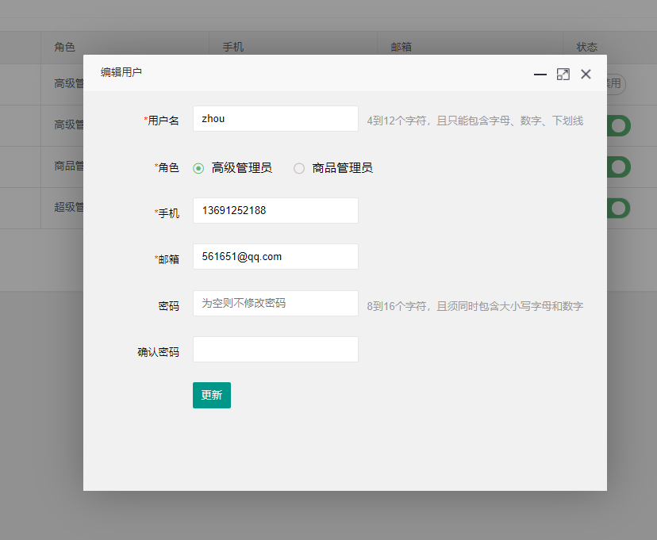

#### 1.1.2 日志模块

只有超级管理员和高级管理员可以访问日志模块

除index、welcome等非敏感页面的请求外，所有操作（包含鉴权失败的）均会被记录

- 日志列表，支持按日期、用户名搜索

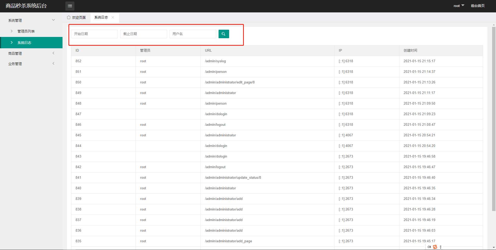

#### 1.1.3 商品管理模块

只有超级管理员和商品管理员可以访问商品管理模块

- 商品信息，支持按商品名搜索

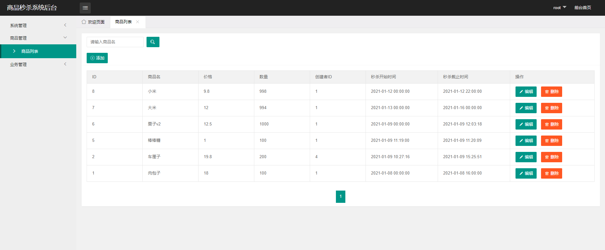

- 增加、编辑商品信息

时间选择器使用layui的组件。输入的数据要验证具有意义：秒杀开始时间不能晚于截止时间，商品价格为非负浮点数，商品数量为非负整数

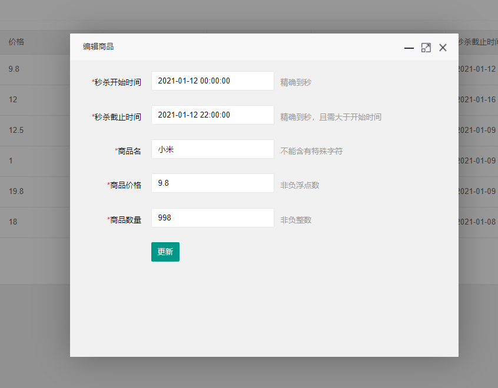

- 删除商品

#### 1.1.4 客户管理模块

只有超级管理员和高级管理员可以访问客户管理模块，客户手机号为秒杀商品时的唯一身份标识，抢购码在新增客户时随机生成

- 客户（有抢购资格的用户）信息，支持按手机号查询

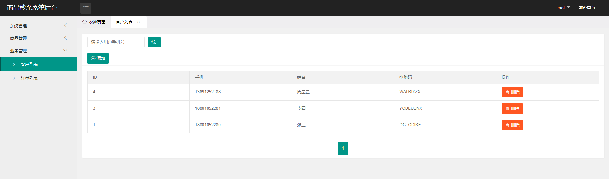

- 增加、删除客户

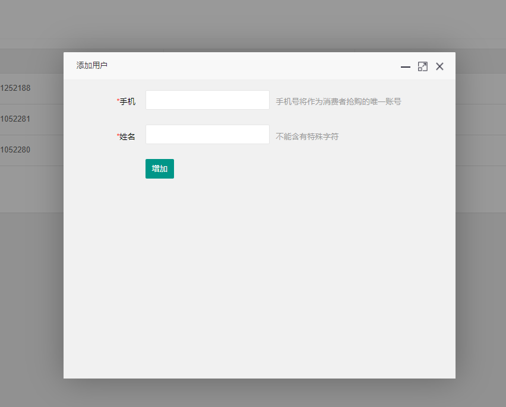

#### 1.1.5 订单管理模块

只有处理成功的订单才会被记录

- 订单信息，支持按日期、手机号、商品查询

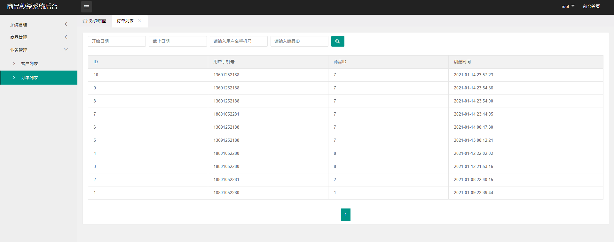

### 1.2 用户端

#### 1.2.1 秒杀业务模块

- 当前可秒杀或未来可秒杀商品展示

只显示还未过截止时间的商品，开始秒杀按钮设置了如果还未到秒杀开始时间则会弹出警告框，阻止进入下单页面

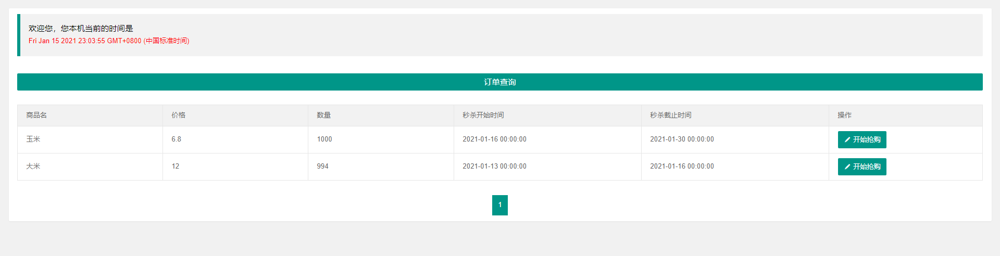

- 商品下单

使用验证码，防止客户使用脚本，设定每次下单的商品数量为1

即使用户在前端绕过了时间限制进入了下单页面，发送的下单请求也会在后端被拦截

用户下单请求经各项验证合法并成功送往消息队列后，就会返回下单成功的信息，但并不意味着秒杀已经成功

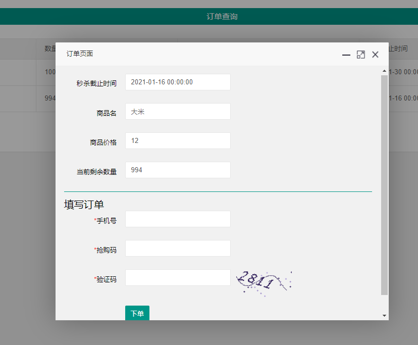

- 订单查询

用户只有在这里通过手机号查到了订单信息，才真正代表秒杀成功

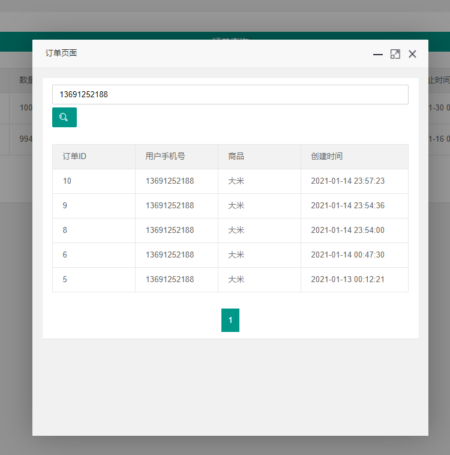

### 1.3 订单处理程序

订单经后台验证各项合法后，会送往RabbitMQ，订单处理程序负责取出消息及对后续对数据库的操作

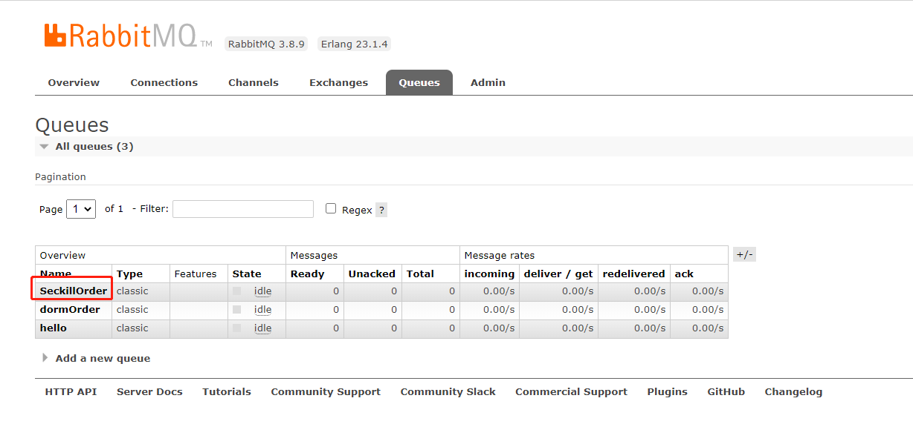

## 2 系统功能实现

### 2.1 整体架构

系统使用基于Go语言的Beego框架，MVC模式，前端使用X-admin框架

- 项目目录

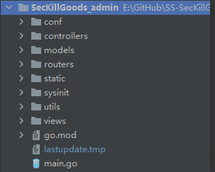

| 目录/文件   | 作用                                                         |
| :---------- | :----------------------------------------------------------- |
| conf        | 存放配置信息，包括系统端口、密码加密的salt、连接数据库的各种信息等 |
| controllers | 各个模块功能的实现、控制返回Json或渲染模板                   |
| models      | 各种数据结构体，对应数据库中的表                             |
| routers     | 设定路由规则和对应方法                                       |
| static      | 静态资源文件                                                 |
| sysinit     | 系统初始化时首先要运行的一些程序，包括数据库、消息队列的初始化和各种过滤器中间件的初始化 |
| utils       | 经常用到的一些函数和方法，比如分页、字符串加密、时间戳转换等 |
| views       | 前端模板文件                                                 |
| go.mod      | go包管理工具                                                 |
| main.go     | 系统入口                                                     |

- 数据库表

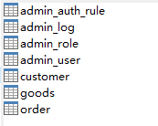

| 表                                  | 内容                                                         |
| ----------------------------------- | ------------------------------------------------------------ |
| admin_user（管理员信息表）          | id、用户名、密码、手机、邮箱、状态、所属角色id               |
| admin_role（管理员角色表）          | id、角色名、角色描述                                         |
| admin_auth_rule（管理员权限规则表） | id、规则名、规则URL、有此权限的角色列表                      |
| admin_log（日志信息表）             | id、管理员id、管理员用户名、操作的URL、IP、操作时间          |
| goods（商品信息表）                 | id、商品名、价格、数量、创建管理员id、秒杀开始时间、秒杀截止时间 |
| customer（客户信息表）              | id、手机、客户名、抢购码                                     |
| order（订单信息表）                 | id、客户手机、商品id、创建时间                               |

### 2.2 后台管理端

#### 2.2.1 过滤器

过滤器运行在每次请求所匹配URL的路由前

**登录验证**：使用session判断用户是否已登录，若未登录则重定向至登录页面

**日志记录**：登录验证通过后，用户所请求的操作都会被记录

**权限控制**：session中存有用户的角色信息，每次请求被执行前都会检索权限规则表看看当前请求是否需要权限控制，若需要，则检查当前角色是否有权访问，若无权访问则会重定向至”权限错误“页面。由于日志过滤器设置在权限控制之前，因此请求失败的信息也会被记录。

#### 2.2.2 信息的展示

使用Beego自带ORM查询数据库，若有关键词搜索，则进一步过滤，使用模板将数据渲染到页面中。使用分页。

#### 2.2.3 信息的增加、更新、删除

均使用异步请求，前端根据controller返回的json信息反馈请求成功或是失败。

请求成功后自动刷新页面。删除前要求二次确认。表单信息使用POST提交，对某一条数据的操作使用URI传参。

数据在前后端均进行验证，意义要合理，格式字符要合法。前端使用layui的verify组件，后端使用Beego的validation组件。

### 2.3 用户端

**验证码**：使用Beego的captcha组件

**时间信息的控制**：为了减轻后端压力，前端使用Js实时显示客户端的时间，即使用户绕过前端的限制进入商品下单页面，在发送请求时也会被后端拦截。

**下单**：对下单的请求是经过一系列验证的，验证码、用户信息、时间信息等。如果验证失败会给出反馈，验证成功才会发送到RabbitMQ

### 2.4 订单处理程序

实时监听RabbitMQ的消息。由于接收到的数据已经被验证过，因此订单处理程序只需专注于对数据库中商品表和订单表进行操作。操作包含在一个事务中，如果中间出错会全部回滚。

## 3 性能优化策略及实现

- 使用RabbitMQ处理订单消息

作用：解耦、异步、削峰

## 4 应用安全策略及实现

- 使用过滤器进行登录验证，cookie只存sessionID
- 使用过滤器进行RABC鉴权，不同角色职责分离，角色信息在服务端
- 对输入内容在前端及后端均进行验证，只能输入合法字符，防止XSS和SQL注入
- 数值型、日期型均检验其合理性
- 密码加密保存在数据库中，使用MD5加盐加密
- 密码复杂度高，使用强口令 
- 使用验证码，防止脚本代刷，且与其他信息在同一请求提交，用完即失效
- 敏感操作均有日志记录
- 数据库一库一账号
- 数据库信息、salt等敏感信息写在配置文件里
- 表单信息均使用POST异步请求提交
- 页面输出内容：go 模板引擎自带script转义

